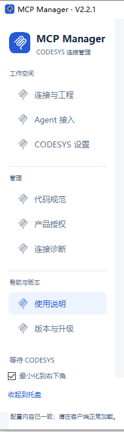

# CODESYS API MCP 2.2.1 完整测试反馈与修改建议

日期：2026-10-05。修复执行地点：开发电脑。反馈地点：Windows 10 VMware 测试电脑。

**总体结论：安装完成；Codex 可通过真实 MCP 创建工程并提交编辑，但编译、诊断恢复及最终保存未通过。WorkBuddy 仅验证到配置与工具发现，第二个温控工程未生成。不能宣布双 Agent 或完整 MCP 功能通过。**

本报告区分三类证据：**本机实测**、**代码检查**、**开发电脑待验证**。建议中的新功能均未在本机实现。历史误判已保留在对话记录中并在本文纠正。

## 1. 用户已确定的修改范围

| 编号 | 必须完成的修改 | 完成后的用户体验 |
|---|---|---|
| R1 | 在开发电脑逐版本验证初始模板；没有合适模板时，明确指导操作者制作，并在 Manager 通过路径选择设置为当前版本模板 | 操作者能看懂缺什么、如何制作、选择哪个文件；不需要手工维护模板索引、固定摘要或复杂登记材料 |
| R2 | 修复编译诊断读取、原请求恢复、重复诊断和队列阻塞问题 | 一次失败有明确结果及处理入口，不要求删整个数据目录，不自动重放已经执行的编辑 |
| R3 | 取消免费试用，所有发布版本必须获得有效授权才能使用 MCP 功能 | 不存在首次使用自动赠送 30 天，也不存在删记录恢复试用；未授权仍能查看状态、申请和导入授权 |
| R4 | 只保留一份完整图文使用说明，并按真实操作顺序重排 | Manager 的“使用说明”是一致入口，其他帮助链接跳到同一文件的对应章节 |

**范围排除：**前面讨论过的代码混淆、核心防读取和反编译保护，本轮不实施；前面提出的“保留 30 天签名试用”方案已被用户最新的“取消试用”要求取代。公钥内部验签能力应保留，普通界面不显示完整公钥不是缺陷。

## 2. 安装包、测试环境与覆盖边界

| 项目 | 本次记录 |
|---|---|
| 安装包 | `CodesysApiMCP-2.2.1-Windows-x64-Full.zip`；155,918,326 字节 |
| 来源 | [用户指定的 v2.2.1 发布](https://github.com/qq123659129/CodesysApiMCP-Installer/releases/tag/v2.2.1) |
| 发布身份 | `v221-release-019`；候选 `v221-product-019`；源码提交 `9896fdb108bb2479827fd68c36a4375e2e7376d0` |
| 系统 | Microsoft Windows 10 家庭版，10.0.19045，64 位；VMware Virtual Platform |
| 实际 CODESYS | SP19 Patch 5 / 3.5.19.50；本机实际可用实例，不是保存配置里残留的 SP19 Patch 6 路径 |
| 脚本组件 | 安装探测记录 4.2.0.0；实际 Watcher 连接成功 |
| 曲线组件 | 本机文件检查发现 Trace 4.4.0.0 和 4.1.0.0；文件存在不等于确认实际加载版本。曲线创建操作返回已应用，但最终完整读回未完成，不能视为功能全部通过 |
| 本机设备目录 | Control Win V3 及 x64 对应设备目录均仅发现 3.5.19.50 |
| 安装与数据目录 | `D:\CodesysApiMCP-V2\V2.2.1\installed` 与 `D:\CodesysApiMCP-V2\V2.2.1\data` |
| 客户端 | Codex 官方命令行 Agent；WorkBuddy 安装的内置命令行入口，桌面测试未完成 |
| 测试工程目标 | 官方 Util PID 温控模块，10ms 任务，目标温度、反馈温度、输出百分比三条曲线 |
| 公开 MCP | 本版实际发现 8 个工具；任务、库和离线曲线为限定支持，在线运行与采集未开放正式能力 |

证据：[发布信息](evidence/package/release.json)、[下载核对](evidence/package/download-verification.json)、[本机环境及曲线组件文件](evidence/test-environment.json)、[安装实例探测](evidence/codesys-installations.json)、[连接与模板状态](evidence/manager-connection-state.json)、[设备观察](evidence/device-dependency-observation.json)。包下载校验是本次历史证据，不是要求今后的用户模板增加摘要门槛。

本机没有完成 SP18、SP19 Patch 6、SP20 的工程测试。安装包文档对开发电脑的历史验证描述不能代替本轮测试；开发电脑必须重新提供各版本证据。

## 3. 已完成和未完成的事实

1. 用户指定安装包下载并安装成功。Codex、WorkBuddy 只增加本服务配置，其他配置保留；WorkBuddy 命令行自行增加空的禁用列表，未据此更改既有服务状态。
2. Codex 真实 Agent 发现工具并调用状态工具成功，随后连接 SP19 Patch 5，通过公开 MCP 从 `minimal-sp19-patch5` 创建独立工程。
3. 新建工程初始任务为 20ms，仅调用空的 PLC_PRG；新建操作本身没有编译，不能将“创建成功”解释为“环境可编译”。
4. 单次编辑请求添加官方 Util 库、创建两个程序对象、设置 10ms 任务及唯一调用、创建三变量曲线。工具返回六项已应用，随后一次编译失败，保存计数为 0。
5. WorkBuddy 已读取新服务配置并发现 8 个工具，但 Agent 返回需要登录，实际未调用状态工具，未生成第二个工程。不能据此断言桌面账户已退出。
6. CODESYS 快捷脚本、图标和注册文件已准备，菜单或工具栏入口尚未完成验证。
7. 本次工程操作坚持使用公开 MCP。界面工具只用于安装及应用入口准备，未用界面操作补做工程编辑、编译或曲线配置。
8. 截图与鼠标操作在 VMware 环境出现超时或坐标不可用；这些属于本次客户端自动化的限制，不能归为 MCP 工程接口本身的编译缺陷。

证据：[配置保留核对](evidence/configuration-verification.json)、[Codex 调用全过程](evidence/codex/engineering-events.sanitized.jsonl)、[WorkBuddy 记录](evidence/workbuddy/status-events.sanitized.jsonl)、[快捷脚本准备](evidence/shortcut-installation.json)。

## 4. R1：初始模板验证及 Manager 路径设置

### 4.1 已确认的问题

**不是没找到模板，也不是选择了错误的编译器版本。** 本次实际使用 SP19 Patch 5 对应模板，编译器为 3.5.19.50；但模板要求的 Control Win V3 3.5.19.60 在测试机不可用。

| 随包模板 | 对应开发软件 | 登记编译器 | 登记设备要求 | 本轮状态 |
|---|---|---|---|---|
| minimal-sp18-patch6 | 3.5.18.60 / SP18 Patch 6 | 3.5.18.50 | Control Win V3 3.5.19.60 | 本机未测 |
| minimal-sp19-patch5 | 3.5.19.50 / SP19 Patch 5 | 3.5.19.50 | Control Win V3 3.5.19.60 | 创建成功，设备缺失导致编译失败 |
| minimal-sp19-patch6 | 3.5.19.60 / SP19 Patch 6 | 3.5.19.60 | Control Win V3 x64 3.5.19.50 | 本机未测；本机无该可用 IDE |
| SP20 | 文档涉及 SP20 Patch 6 | 无随包模板 | 无 | 不能自动使用相邻版本代替；新功能应提供用户模板路径 |

开发软件、编译器、设备的版本数字可以不同，关键是组合真实可用。现有模板检查确认版本、启动配置及文件摘要后就显示可用，没有证明目标电脑设备和库齐全。[模板索引证据](evidence/package/template-index.json)

**执行责任：**安装包的环境说明已经要求分别核对上述依赖。我未在业务编辑前完成设备依赖检查，也未验证初始工程可编译；这是执行遗漏，不能归因于 MCP 没有明确说明。先前将问题笼统描述为“模板版本错误”也不准确。

### 4.2 开发电脑必须补做的完整验证

- 先列出已知、实际安装及拟支持的每一个完整 CODESYS 版本和启动配置，至少覆盖现有三个随包模板；文档继续宣称支持的其他版本也应明确验证或标为未验证。
- 对每个版本，从该版本可用设备创建最小工程，读取实际编译器、设备与库；确认无缺失依赖，完成编译、保存、关闭后重开、再次读取和必要的重开编译检查。
- 再从交付模板通过公开 MCP 新建副本，执行官方 PID、10ms、三变量曲线测试，完整读回、编译并保存；不能只在制作模板的开发目录验证一次。
- 在另一台干净测试机或虚拟机验证安装后的同一文件，避免开发电脑额外安装的设备、库或组件掩盖缺失。
- 记录每行实际结果、环境组合和错误信息。没有测试的版本不得填“通过”，不得用一行统称“SP18/SP19 均兼容”。

### 4.3 给操作者的最小模板制作要求

以下文字应直接写入统一使用说明，并由 Manager 在缺少模板时跳转显示：

1. 用 Manager 当前选择的那个 CODESYS 版本创建并保存一个普通 `.project` 工程；不使用另一个版本的文件冒充，不使用压缩归档作为模板路径。
2. 选择本机已安装且准备使用的设备描述；所有设备、编译器、库依赖必须能正常解析。通用测试模板优先使用可用的 Control Win 设备，不包含真实设备地址或凭据。
3. 保留一个应用、一个库管理器、一个循环任务 MainTask 和一个空的结构化文本程序 PLC_PRG；任务只调用该程序一次。建议初始周期为 20ms，具体业务如温控再由 MCP 设置为 10ms。
4. 初始模板不放 PID 业务、曲线对象、用户密钥或现场程序，避免“新建”就带入旧业务。
5. 在该 CODESYS 版本中编译无错误，处理全部警告，保存。验证重新打开后无需迁移或修复依赖即可编译。
6. 回 Manager 选择刚保存的文件，完成验证后作为当前版本的初始工程。版本、设备或文件位置变化后需重新核对。

### 4.4 Manager 简单交互建议

将模板设置放在“CODESYS 设置”中，与当前选择版本放在一起：

> 当前 CODESYS：SP19 Patch 5 / 3.5.19.50  
> 初始模板：`某个路径\MinimalTask.project`  
> **选择模板文件…**　**验证并使用**  
> 验证结果：可用，或用一句话说明缺少的设备／库及处理入口。

- 有经过验证的随包模板时显示默认路径；没有匹配模板，或现有模板在本机缺依赖时，直接提示制作要求并提供文件选择入口。
- 设置按实际完整版本和启动配置分别保存，互不串用。实际连接的 CODESYS 版本与所选设置不一致时明确提示，不静默选择近似版本。
- 验证重点是文件存在、可读、对应版本能打开、依赖齐全、编译通过和已保存。发现当前打开工程有未保存修改时应保护现场，不能为了验证模板直接关闭或覆盖。
- **不要为用户模板增加固定 SHA、大小指纹、手工修改索引或复杂登记过程。** 路径选择和真实工程验证足够支撑这个流程。文件被移动、损坏或改到不能编译时，给可理解的错误并允许重新选择。
- 后续 Agent 新建调用使用这份已设置模板，写到新的工程路径；模板原件不承载业务编辑，不覆盖已有目标工程。

开发验收项目见 [T01–T12](ACCEPTANCE.zh-CN.md)。

## 5. R2：MCP 异常恢复

### 5.1 本机实测链路

实际编辑请求为 `codex-temp-build-01`。返回六项已应用，实际编译 1 次、保存 0 次、原生操作 34 次；随后发生：

1. 编译报 `C0188`：“系统没有安装设备。不能生成代码。”同时存在 3SLicense、CAA Device Diagnosis 加载失败及相关类型未知等消息。
2. 读取编译诊断时遇到无效对象标识：`ce58700a-63da-5e62-b344-974f3216c491`，结果变成 `UNKNOWN / DIAGNOSTICS_UNREADABLE`，即结果不确定且诊断不能完整读取。
3. 持续观察同一请求，诊断数量从 24 增至 312、1848；去重后为 22 条错误、2 条信息。这些不是稳定的编译错误总数，不能据此报告完整诊断已取得。
4. 服务显示空闲，但原请求仍未明确结束。补做的批量只读请求 `codex-review-read-20261005-01` 两次观察均排队，派发和工程操作计数为 0；最终通过公开接口取消，未取消或重放原编辑。
5. 之后 CODESYS 退出，状态显示连接中断；观察原请求时收到 `MCP error -32000: Connection closed`。这条连接异常的具体根因尚未独立确认，不能直接等同于服务崩溃。

证据：[原请求最终记录](evidence/codex/final-original-request.json)、[只读排队返回](evidence/review/codesys_request-2026-10-05T01-36-13-860Z.json)、[取消未执行读取](evidence/review/codesys_request-2026-10-05T01-37-12-105Z.json)、[重新生成前状态](evidence/review/regenerate-status.json)。用户后来报告清空 Manager 数据目录；本轮没有证明清空之后工程能力恢复，不能把删除目录作为修复方案。

### 5.2 已核对的代码位置与修复方向

| 安装包内位置 | 观察 | 修复要求 |
|---|---|---|
| watcher/v22_native.py，约 835–884 行 | 读取某条编译消息的对象引用时可抛异常；异常被转换为整个请求结果不确定 | 单条消息的对象位置解析失败，应尽量保留文本、级别、编号及其他消息；编译结果、诊断完整性和编辑执行状态分别报告 |
| dist/core/service.js，约 352–354 行 | 将之前结果的 diagnostics 再拼入本次恢复结果 | 恢复查询必须返回稳定结果；区分一次性的输入警告与编译诊断，不能每次查询累加同一批消息 |
| 同文件约 240–244 行 | 存在结果不确定请求时停止整个队列派发 | 不能让操作无限排队且缺少处理办法；明确阻断原因、允许的只读核对及安全恢复路径 |
| 同文件约 437–470 行 | 恢复继续读取原结果；只能取消未执行请求 | 保留“不自动重放”原则，同时为已知完成但诊断部分失败、连接退出、进程重启分别提供明确结束或人工核对后的恢复方式 |

这些位置基于[安装包代码片段核对](evidence/implementation-observations.md)。无效对象具体来自哪一条编译消息、退出后的连接为何关闭，仍需开发电脑进一步定位；不能靠推测改成“通过”。

### 5.3 期望行为

- 对已确认发生的编辑、编译、保存分别给事实，不能因为辅助诊断出错就丢掉所有执行证据；诊断不完整时也不能假装编译通过。
- 同一原请求重复查看，内容、诊断数量和实际操作计数稳定；观察行为不再次执行编辑、编译或保存。
- 真正无法确定是否执行的请求保持保护状态，但界面应说明哪个请求、哪个工程、已知效果及下一步，不显示无期限的“排队中”让用户猜测。
- 能安全读取时，允许受控的状态及受影响对象核对；无法安全读取时，直接说明阻断原因，避免制造永远不会执行的排队请求。
- 恢复不能以清空整个 data 为默认操作。若需要处置历史失败记录，应只针对该请求，先保留诊断与审计记录，核对当前工程和连接后再解除阻断。
- 已退出 IDE、新连接或新工程不能误用旧上下文；旧编辑绝不在重启后悄悄重放。保护现有未保存工程。
- 自动恢复应有合理次数和输出大小限制，异常不使记录持续膨胀；取消仍只适用于尚未派发的请求。

开发验收项目见 [E01–E10](ACCEPTANCE.zh-CN.md)。

## 6. R3：取消所有自动免费试用

### 6.1 现状与证据强度

当前默认 30 天状态独立存放于系统授权目录，不在用户指定的 Manager data 下。授权状态查询曾实际返回默认试用有效，开始时间为 2026-10-05 09:14:50，到期为 2026-11-04 09:14:50，时区 UTC+08:00。

安装包授权代码在默认试用记录和时间记录都缺失时，将其判定为尚未开始；下一次实际使用会建立新的 30 天记录。**这属于代码检查确认的重置缺口，未实际删除授权文件或执行绕过测试。** 对应[代码片段和行号](evidence/implementation-observations.md)已附入证据。

### 6.2 用户最终要求

**取消试用，所有发布版本必须获得授权才可使用 MCP 功能。** 不再实现“隐藏试用文件”，不再自动签发或补发免费 30 天；这取代了前面讨论过的签名试用方案。

- 删除自动试用初始化、默认试用回退，以及正式授权缺失时重新赠送期限的路径。旧试用记录不能作为新版本的有效使用凭据。
- 无授权、到期、机器不匹配、签名无效或时间记录异常时，禁止受授权控制的工程功能，返回可理解的原因；仅保留安装、查看状态、申请码、导入授权、说明和诊断等恢复入口。
- Manager、Agent、直接公开 MCP 调用和所有受控工程入口使用同一授权判断，不能只在界面禁用按钮。
- 保留正式授权数字签名、机器绑定及期限校验；公钥用于程序验证，普通页面无需显示完整公钥，更不能允许操作者任意替换信任公钥。
- 私钥只留在开发者控制的签发环境，不能随安装包发布。未授权不能妨碍用户查看自己已有工程或清楚获知恢复步骤；授权到期也不应强行关闭 IDE 或干预已运行 PLC。
- 重新安装、升级、切换 Manager 数据目录、删除本地运行数据、正式授权损坏，都不能触发免费期。
- 在说明中明确适用版本与升级行为。对已经公开发布并被用户保存的旧版安装包，不能仅靠发布新版就承诺远程撤销其旧逻辑；旧包标为已知缺陷版本并引导升级，能否回收旧包另按实际发布渠道处理。

开发验收项目见 [L01–L10](ACCEPTANCE.zh-CN.md)。授权文件、机器指纹和私钥不随本反馈上传。

## 7. R4：合并为一份图文使用说明

### 7.1 当前问题

现有说明分布于 Manager README、Manager-Usage 的 Markdown/TXT、Environment-Setup、Project-Usage、脚本说明 HTML/TXT、不同 Agent 指南及技能说明，容易出现入口不一致、顺序跳转和历史内容混入当前流程。

用户截图证明当前 Manager 左侧有“连接与工程”“Agent 接入”“CODESYS 设置”“产品授权”“连接诊断”“使用说明”等入口。截图只证明导航现状，不证明所有内部页面已经按某种结构完成。

### 7.2 唯一说明文件与章节结构

建议只交付一份 `使用说明.html`，图片嵌入文件，支持离线阅读、目录跳转及本页查找。所有 Manager 帮助按钮打开同一文件的对应章节。不要再维护一套 Markdown、一套 TXT、一套独立脚本图文正文；开发测试报告及第三方许可不是用户操作手册，不混入菜单。

必须按用户指定顺序组织：

| 章节 | 应包含的内容及操作结束标志 |
|---|---|
| **01 MCP功能介绍** | 能完成哪些工程操作、支持范围、离线曲线配置与在线采集的区别、完整使用流程示意；不把工具发现当工程通过 |
| **02 MCP安装说明，除Codesys外的环境要求描述** | Windows/虚拟机要求、.NET、随包 Node、安装目录与 data 的区别、安装步骤、授权申请与导入、升级/卸载/数据保留；明确不需要全局安装 Node/Python |
| **03 Codesys版本设置与脚本、Trace包的安装配置过程说明** | 选择完整版本和实例，区分“下次启动选择”与“实际连接版本”；逐步说明 Scripting 与 Trace 包的安装、配置、确认；设备/编译器/库检查；缺模板时制作和路径设置 |
| **04 选择Codesys版本后启动Codesys，脚本添加说明** | 启动选定实例、运行固定连接脚本、添加菜单/工具栏快捷方式、处理旧绑定、确认实际连接与工程；已有 IDE 不重复启动，保护未保存工程 |
| **05 Agent接入说明** | Codex、WorkBuddy 等各自的配置、加载与信任、登录要求、真实状态调用；保留其他配置；区分命令行与桌面；再给官方 PID、10ms、三变量曲线的完整工程示例与验收方法 |
| **06 后续其他内容** | 日常已有工程/新建/保存操作、编码设置、授权续期、版本更新、连接诊断、失败请求恢复、常见错误、支持矩阵与已知限制 |

### 7.3 图文与维护要求

- 按“准备条件 → 点击位置 → 填写内容 → 正常结果 → 常见失败与下一步”描述每个过程；一张截图应对应具体一步。
- 使用当前交付版本、实际存在的控件和路径；标注按钮或区域，保持中文正文先解释含义。旧版本截图不能不标注就当作当前验证。
- 重点补齐组件安装、版本选择、模板文件选择、脚本添加、Agent 信任/登录、授权导入和请求恢复的截图。
- 支持矩阵明确每个完整版本、编译器、设备及组件组合；模板存在、连接成功、工程通过分开显示。
- 从干净测试环境按手册从头操作，仅依赖这一个文件完成安装、授权、模板、连接、Agent 调用和示例工程；每一步核对真实界面与结果。
- 旧帮助入口统一重定向到本文件章节，发布包清理重复操作正文；技能文件仅保留必要机器操作规则及手册章节引用，不形成第二套用户说明。

开发验收项目见 [D01–D08](ACCEPTANCE.zh-CN.md)。

## 8. 双 Agent 温控示例的准确状态

原提交的官方库为 `Util / 3.5.19.0 / System`，功能块是 **Util.PID_FIXCYCLE**，周期参数 `CYCLE = 0.01` 秒。这是官方固定周期 PID，不是自行编写 PID 算法，也不是名称为 PID 的另一个功能块。

调用关系：MainTask → PRG_Temperature_PID → FB_TemperatureControl → fbPID（官方功能块实例）。调用位于温控封装内，因此主程序没有直接出现官方类型名。

- [温控模块代码留存稿](code/FB_TemperatureControl-UNVERIFIED.st)
- [测试主程序代码留存稿](code/PRG_Temperature_PID-UNVERIFIED.st)
- [原始六项提交](evidence/codex/submitted-batch-UNVERIFIED.json)

提交中包含 10ms 唯一任务调用、目标温度/反馈温度同图、输出百分比独立图且纵轴 0–100。它们只是提交内容和已应用返回，没有最终独立读回和保存证明。原提示将功能块名称误写为 PID_FIXEDCYCLE，执行时已查官方文档纠正为 PID_FIXCYCLE；保留历史提示作为执行问题证据，不改写历史。

修复后 Codex 和 WorkBuddy 必须分别由各自真实 Agent 创建独立工程；不能复制 Codex 工程充当 WorkBuddy 验证。曲线配置完成不等于已采集运行曲线；本版在线能力未正式开放，报告应保留这个边界。

原 Agent 遇到过六次字段校验拒绝，均在派发前、没有修改。后续直接读取公开工具定义可见完整变更项结构，因此当前证据不足以断言服务根本没有字段定义；应检查客户端如何向 Agent 展示和消费复杂字段，减少试错。作为接入可用性跟进，不替代 R1–R4。

## 9. 修复顺序、执行责任与交付

建议开发电脑先解决模板/依赖与异常恢复，再完成取消试用及统一说明，最后使用最终安装包做双 Agent 回归。取消试用后，测试机必须使用合法测试授权，不能靠恢复默认试用让验证通过。

执行方遗漏包括：未先检查设备依赖、初始编译验证不充分、原执行提示限制只读核对过严、报告曾错误归因为“用户要求”、官方 PID 定位说明不清。报告已修订；这些责任不抵消产品应改进的兼容检查及异常恢复问题。

开发交付应包括：修复源码提交、安装包版本/构建标识、各版本模板与环境矩阵、一次完整双 Agent 证据、单一图文说明及已知限制。不能只给修改截图、文本代码、模板文件存在或零计数就宣布完成。

完整过程见 [对话全文](CONVERSATION.zh-CN.md)、[时间线](TIMELINE.zh-CN.md)和[证据索引](EVIDENCE-INDEX.zh-CN.md)。本反馈没有修改安装包源码、模板或授权逻辑，也没有把未成功保存的工程作为最终程序上传。
